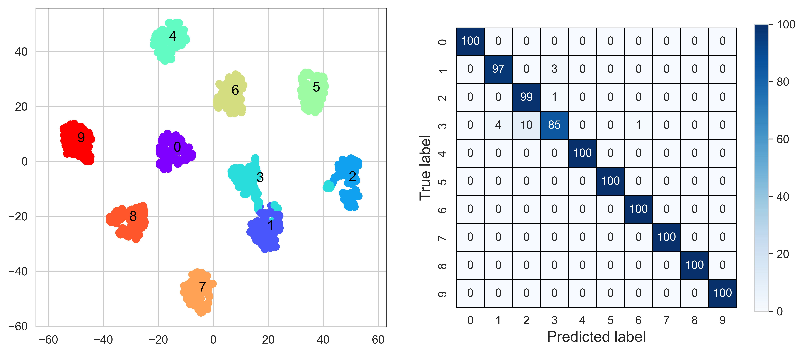

# Plot t-SNE+Confusion Matrix

Plot t-SNE+Confusion Matrix for the Outputs of Neural Network

require:

~~~python
pip install scikit-learn
pip install torch
pip install matplotlib
~~~

code:

~~~python
def draw_tSNE(net, test_loader, device=None, num_classes=10, perplexity=20):
    import numpy as np
    import torch
    from seaborn import heatmap
    from sklearn.manifold import TSNE
    from sklearn.metrics import confusion_matrix
    from sklearn.cluster import KMeans
    import matplotlib.pyplot as plt 
    
    if device is None:
        device = torch.device("cuda:0" if torch.cuda.is_available() else "cpu")
    
    X = torch.tensor(data=[]).to(device)
    Y = torch.tensor(data=[]).to(device)
    P = torch.tensor(data=[]).to(device)
    
    with torch.no_grad():
        for samples, labels in test_loader:
            samples = samples.to(device)
            labels = labels.to(device)
            outputs = net(samples)
            X = torch.cat([X, outputs])
            Y = torch.cat([Y, labels])
            _, predicted = torch.max(outputs, 1)
            P = torch.cat([P, predicted])
    
    x = X.cpu().detach()
    y_true = Y.cpu().numpy()
    y_pred = P.cpu().numpy()
    
    X_embedded = TSNE(n_components=2, learning_rate='auto',
                      init='random', perplexity=perplexity).fit_transform(x)
    
    position_list = [{'x': [], 'y': []} for _ in range(num_classes)]
        
    for i in range(0, len(y_true)):
        position_list[int(y_true[i])]['x'].append(X_embedded[i][0])
        position_list[int(y_true[i])]['y'].append(X_embedded[i][1])
    
    model = KMeans(n_clusters=1) 
    
    fig, ax = plt.subplots(1, 2, figsize=(12, 5))
    
    ax[0].scatter(X_embedded[:, 0], X_embedded[:, 1], c=y_true, 
                  cmap='rainbow')
    ax[0].axis('equal')
    
    for idx, position_dict in enumerate(position_list, 0):
        x = position_dict['x']
        y = position_dict['y']
        pos = np.array([x, y])
        pos = pos.T
        model.fit(pos)
        center = model.cluster_centers_
        ax[0].text(center[0][0], center[0][1], f'{idx}',
                   color='k', fontsize=12)
    
    num_data = len(test_loader)
    num_classes = 10
    mat = confusion_matrix(y_pred, y_true)
    confusion = heatmap(mat.T, square=True, annot=True, fmt='d', cmap='Blues', cbar=False,
                        center=int(num_data / num_classes / 2), vmax=int(num_data / num_classes), 
                        ax=ax[1], vmin=0, linecolor='k', linewidths=0.4, 
                        annot_kws={"size": 10})
    cbar = confusion.figure.colorbar(confusion.collections[0], ax=confusion, location="right",
                                     shrink=0.9)
    ax[1].set_xlabel('Predicted label', fontsize=13)
    ax[1].set_ylabel('True label', fontsize=13)

    for spine in ax[0].spines.values():
        spine.set_edgecolor("black")
        spine.set_linewidth(0.5)
    
    return fig

fig = draw_tSNE(net, device=device, test_loader=test_loader)
 
# .savefig('tsne.jpg', dpi=800, bbox_inches='tight')
~~~

